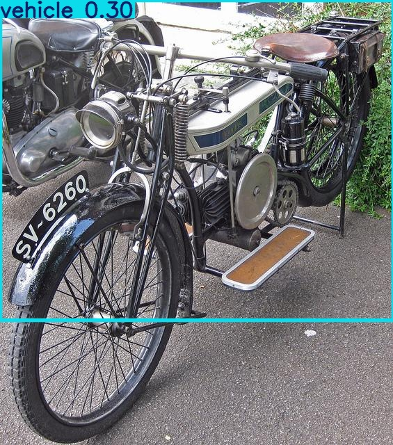

Projeto: Detecção de Objetos com YOLOv5

📋 O que este projeto faz

Este projeto implementa um pipeline completo para treinar, validar e testar um modelo de detecção de objetos com a arquitetura YOLOv5.
Ele automatiza desde a preparação dos dados (aumento, organização), o treinamento customizado, até a inferência para detectar pessoas e veículos em imagens.

🚀 Por que usar YOLO?

YOLO (You Only Look Once) é uma das arquiteturas mais rápidas e eficazes para detecção de objetos em imagens e vídeos.
Detecção em tempo real
Alta precisão para múltiplas classes
Processa a imagem inteira de uma só vez
Ideal para aplicações onde a velocidade e a acurácia são essenciais, como vigilância, monitoramento e robótica.


✨ Por que YOLOv5?

YOLOv5 é uma versão moderna que traz muitas melhorias para tornar o uso mais prático e eficiente:
Implementação em PyTorch, fácil de treinar e adaptar
Código modular e comunidade ativa
Diversos modelos (desde leves até robustos) para diferentes necessidades
Treinamento e inferência mais rápidos
Resultado: modelo leve e potente para projetos reais.

⚙️ Funcionalidades

Treinamento do modelo YOLO em datasets personalizados.
Inferência em imagens únicas ou em lote.
Salvamento das imagens com bounding boxes e classes detectadas.
Exportação dos resultados em arquivos TXT com coordenadas e probabilidades.
Configuração simples via parâmetros de linha de comando.
Suporte a ajustes de confiança, tamanho da imagem, entre outros.


🛠️ Tecnologias Utilizadas

- Python 3.11  
- PyTorch (Torch)  
- YOLOv5 (ultralytics)  
- Google Colab (ambiente de desenvolvimento opcional)  
- OpenCV (manipulação e processamento de imagens)  


🚀 Como Usar

**Treinar o modelo**

1. Preparar o dataset  
   Organize suas imagens e anotações no formato YOLO (bounding boxes com classes).

2. Treinar o modelo  
   ```bash
   python train.py --img 640 --batch 16 --epochs 50 --data data/custom.yaml --weights yolov5s.pt --name custom_yolo

3. Realizar inferência  
   Detectar objetos em uma imagem ou pasta de imagens
   ```bash
   python detect.py --weights runs/train/custom_yolo/weights/best.pt --img 640 --conf 0.25 --source path/para/sua/imagem.jpg --save-txt --save-conf


5. Visualizar Resultados
   As imagens com as detecções e os arquivos TXT com as informações serão salvos em runs/detect/exp.


### 📊 Desempenho do Modelo (YOLOv5)

| Métrica           | O que é?                                                                                                                           | Por que é importante?                            | Resultado do seu modelo                                                      | Avaliação simples                                                              |
| ----------------- | ---------------------------------------------------------------------------------------------------------------------------------- | ------------------------------------------------ | ---------------------------------------------------------------------------- | ------------------------------------------------------------------------------ |
| **Loss (perda)**  | Quanto o modelo está errando no treino (menor é melhor).<br>Inclui erros em localizar objetos, identificar presença e classificar. | Indica se o modelo está aprendendo.              | Box loss \~0.065 - 0.07<br>Obj loss \~0.03 - 0.05<br>Cls loss \~0.008 - 0.01 | Loss está relativamente baixo e estável, mostrando que o modelo aprendeu algo. |
| **Precision (P)** | Percentual de acertos nas detecções feitas. Evita falsos positivos.                                                                | Queremos alto para evitar “detectar errado”.     | Geral: \~0.61 (61%)<br>Person: 58.8%<br>Vehicle: 62.5%                       | Moderado, bom para algumas aplicações, mas pode melhorar.                      |
| **Recall (R)**    | Percentual de objetos reais que foram detectados.                                                                                  | Mede se modelo não perde objetos.                | Geral: \~0.33 (33%)<br>Person: 51.9%<br>Vehicle: 15.9%                       | Recall está baixo, modelo perde muitos objetos, especialmente veículos.        |
| **mAP50**         | Qualidade geral da detecção com sobreposição >50%. Combina precisão e recall.                                                      | Métrica principal para detecção de objetos.      | Geral: 0.44 (44%)<br>Person: 57.3%<br>Vehicle: 31.5%                         | Moderado, aceitável para protótipos ou problemas simples.                      |
| **mAP50-95**      | Métrica mais rigorosa com sobreposição variável (0.5 a 0.95).                                                                      | Avalia qualidade detalhada da caixa de detecção. | Geral: 0.22 (22%)<br>Person: 30.3%<br>Vehicle: 14.5%                         | Baixo, indica que caixas podem não estar muito precisas.                       |


**Conclusão sobre o modelo:**

- O modelo aprendeu e apresenta uma precisão razoável.
- O recall está baixo, indicando que muitos objetos reais não foram detectados, principalmente veículos.
- O mAP50 está em nível moderado (44%), o que é aceitável para protótipos ou problemas simples.
- O mAP50-95 está baixo, sugerindo que a precisão das caixas delimitadoras pode ser melhorada.
- Para aplicações de produção ou mais críticas, o modelo precisa ser aprimorado, aumentando o recall e a precisão geral.
- Melhorias podem ser feitas com mais dados, ajuste de hiperparâmetros, ou aumentando o número de epochs.




*Legenda: Imagem detectada e rotulada corretamente pelo modelo YOLOv5.*


